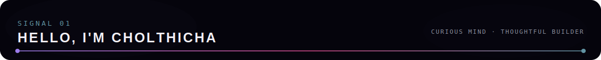
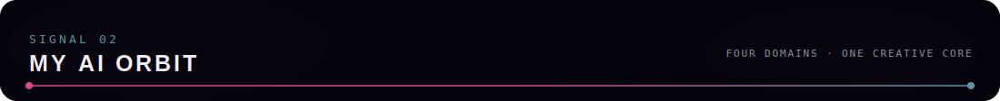
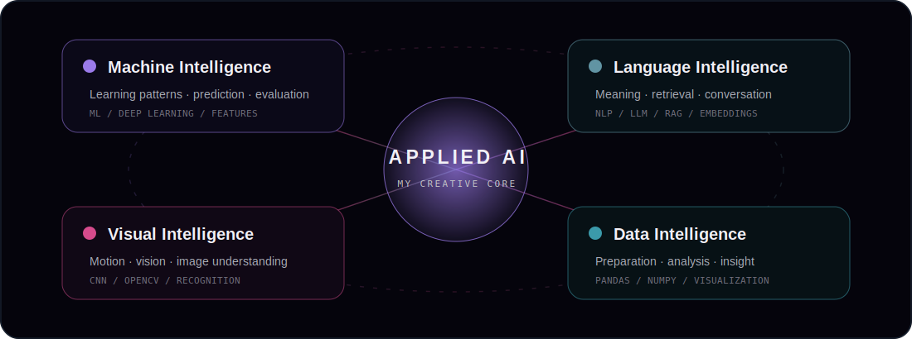
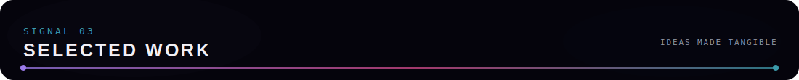
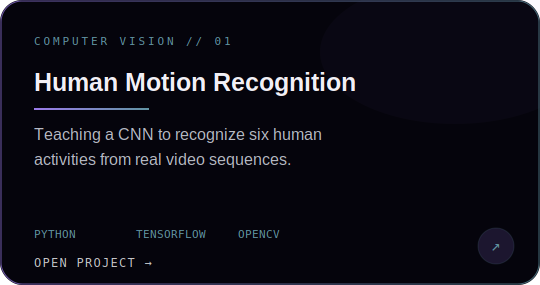
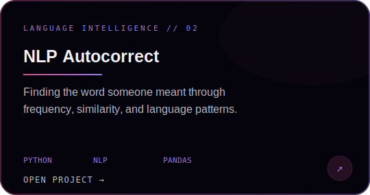
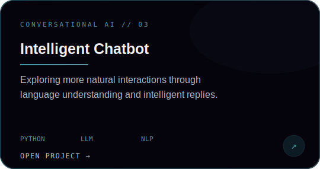
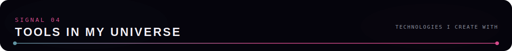
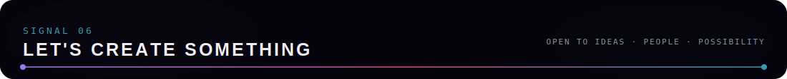

 

 
<!--
`THOUGHTFUL AI` &nbsp; ✦ &nbsp; `CURIOUS BY NATURE` &nbsp; ✦ &nbsp; `BUILDING WITH PURPOSE`

 

 
 

### I’m fascinated by the moment when data begins to feel intelligent.

I'm **Cholthicha Khanijomdi**, a Computer Science student specializing in **Artificial Intelligence** at Stamford International University. I explore how machines understand language, recognize movement, discover patterns, and turn complex information into experiences that feel useful to people.

 
-->

 

> *I don't just want to make systems that work. I want to understand why they work,  
> how they can improve, and whether they genuinely help the person using them.*

 

 

 

[**Explore everything I’m building →**](https://github.com/CholthichaK?tab=repositories)

 

  

**Intelligence** &nbsp; `TensorFlow` `Keras` `scikit-learn` &nbsp;&nbsp; ✦ &nbsp;&nbsp;
**Language** &nbsp; `NLP` `RAG` `Embeddings`

  

**Vision** &nbsp; `OpenCV` `CNNs` `Motion Analysis` &nbsp;&nbsp; ✦ &nbsp;&nbsp;
**Data** &nbsp; `Pandas` `NumPy` `Matplotlib`

  

Tools change. Curiosity, careful thinking, and the willingness to keep learning stay constant.

 

  

Every square is a small experiment, a lesson learned, or an idea brought a little closer to life.

 

### Have an idea involving AI, language, vision, or data?

I’m always happy to meet curious people, exchange ideas, and discover something new.

 

 

*Learning continuously · Building thoughtfully · Staying curious*

