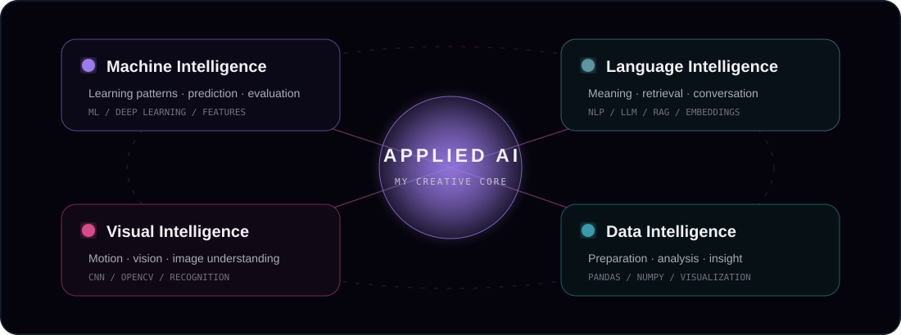

 

  
  
  

### I like the moment when data begins to feel intelligent.

I’m **Cholthicha Khanijomdi**, an **AI developer and creative technologist** based in Bangkok. I build practical systems across machine learning, computer vision, NLP, data analytics, and automation—with a focus on technology that is genuinely useful to people.

`AI DEVELOPER` &nbsp; ✦ &nbsp; `CURIOUS BUILDER` &nbsp; ✦ &nbsp; `HUMAN-CENTRED THINKER`

 

  

 

 

  

[**Explore all repositories →**](https://github.com/CholthichaK?tab=repositories)

 

  

`MACHINE LEARNING` · `COMPUTER VISION` · `NLP & RAG`  
`DATA ANALYTICS` · `API DEVELOPMENT` · `WORKFLOW AUTOMATION`

Tools change. Curiosity, careful thinking, and the willingness to keep learning stay constant.

 

### A living trail of experiments, lessons, and ideas.

<picture>
  <source media="(prefers-color-scheme: dark)" srcset="https://raw.githubusercontent.com/CholthichaK/CholthichaK/output/github-contribution-grid-snake-dark.svg" />
  <source media="(prefers-color-scheme: light)" srcset="https://raw.githubusercontent.com/CholthichaK/CholthichaK/output/github-contribution-grid-snake.svg" />
  
</picture>

Each square marks something explored, understood, improved, or brought a little closer to life.

 

### Have an idea involving AI, language, vision, data, or automation?

I’m open to internships, collaborations, and conversations with people building thoughtful technology.

 

  

*Learning continuously · Building thoughtfully · Staying curious*

